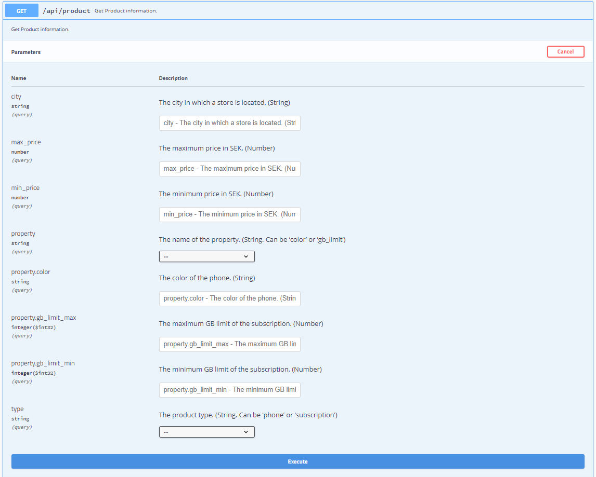

## Guide

- This REST API based project is built with spring boot version 2.3.1. Java Runtime Environment 8 is required to run the application as well as to build the application JDK8 is the minimum requirement.

- The purpose of the project is fairly simple, there is only one API which serves response based on the filter criteria.



- The expected response is a JSON array with the products in a 'data' wrapper. 

**Example:** 
```
GET /product?type=subscription&max_price=1000&city=Stockholm
{
	data: [ 
		{
		    type: 'subscription',
		    properties: 'gb_limit:10',
		    price: '704.00',
		    store_address: 'Dana g�rdet, Stockholm'
	  	},
	  	{
		    type: 'subscription',
		    properties: 'gb_limit:10',
		    price: '200.00',
		    store_address: 'Octavia gr�nden, Stockholm'
	  	}
	]
}
```

- As persistence layer in memory H2 is being used and to manage persistence Spring Data JPA 2.2 is being used.

- Request and Response has been validated by HandlerInterceptorAdapter and ResponseBodyAdvice available under validator package, response has been delivered with an immutable DTO.

- Several auto converter has been introduced to map request parameter with Enum instance which can be found under helper package and the configuration is available at config package

- To handle exception gracefully with ResponseEntityExceptionHandler 

- The class diagram of the database entity is followed - 


- To achieve polymorphic object query JPA inheritance singe table strategy has come in picture.

- TTD approach is being following during the development, Including unit testing and integration testing 4 different types style is available at test folder.
>> 1. Unit testing with mockito jupiter
>> 2. Unit testing Spring Test Framework
>> 3. JPA testing with @DataJpaTest
>> 4. Integration testing with TestRestTemplate

## Prerequisite

You should have following tools installed in your system to run the application

- jdk-1.8.0

- maven 3.6.3 (Optional. Requires, if you don't use mvnw/docker)

- docker (Optional. Requires, if run with docker)

- docker-compose (Optional. Requires, if run with docker-compose)


**Build the application with Maven**

It's a maven based application, To build the application following command need to be run from command line.
~~~
mvn package
~~~
or
~~~
mvnw package
~~~
Again you will need to have minimum JDK8 available at you PATH variable. If you don't have JDK8 installed please follow the docker build section 2.

**Run the application**

~~~
java -jar target/springboot-assignment-telenor.jar
~~~

It's an spring boot application. So, I can be run with spring-boot-maven plug-in like below

```
./mvnw spring-boot:run
```

**Build the Docker image**

- S1.

To build a docker image with the package, that has been generated at the previous step following command is necessary from command line.
~~~
docker build -t springboot-assignment-telenor .
~~~

- S2.

**[Multi-stage](https://docs.docker.com/develop/develop-images/multistage-build/) Docker build: (Everything using docker)**

It's a great way to ensure builds are 100% reproducible AND as lean as possible. On the downside a Maven build in Docker may have to download many dependencies each time it runs. But RUN’ing the `dependency:go-offline` goal, this will download most* of the dependencies required for the build and cache them for as long as the `pom.xml` **doesn’t change**.

At file DockerfileBuildWIthMavenImage is has been illustrated how to build the package from this project source code with maven docker image and then build the docker image. 
Its pretty helpful if no JDK is installed in the system. Only dependency is docker. Following is the command -

~~~
docker build -t springboot-assignment-telenor -f DockerfileBuildWIthMavenImage .
~~~

**Run the Docker image**

To run the newly created image command is give.  
~~~
docker run -p 8080:8080 springboot-assignment-telenor
~~~
NB: Need to make sure, the port 8080 is free.

Prebuild image is also available at the following URL

[DockerHub/nazmulnaim/springboot-assignment-telenor](https://hub.docker.com/repository/docker/nazmulnaim/springboot-assignment-telenor)

To run the prebuild image -
~~~
docker run -p 8080:8080 nazmulnaim/springboot-assignment-telenor:latest
~~~

or, using docker-compose
```
docker-compose up -d
```
There is also another docker compose file for development purpose.

**Build/Run with docker-compose**

To, build the  docker image and run it with docker-compose simply execute this command below

```
 docker-compose -f docker-compose.dev.yml up -d
```

It's will first build the image with the docker context, Then run the app in 8080 port

**Access the application from browser**

Assuming the application is running on local machine, if so then the URL to access the swagger defination will be - 
~~~
http://localhost:8080/swagger-ui.html#/
~~~
And the API URL is - 
~~~
http://localhost:8080/api/product
~~~